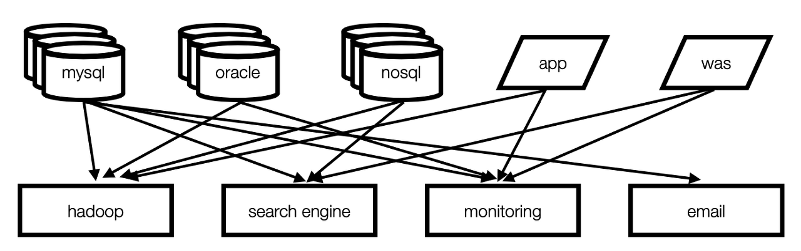
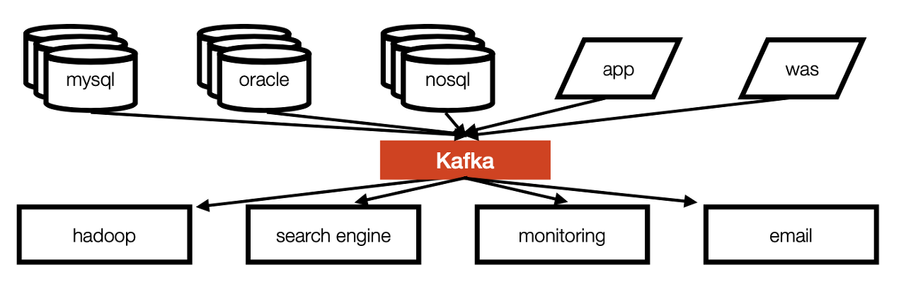
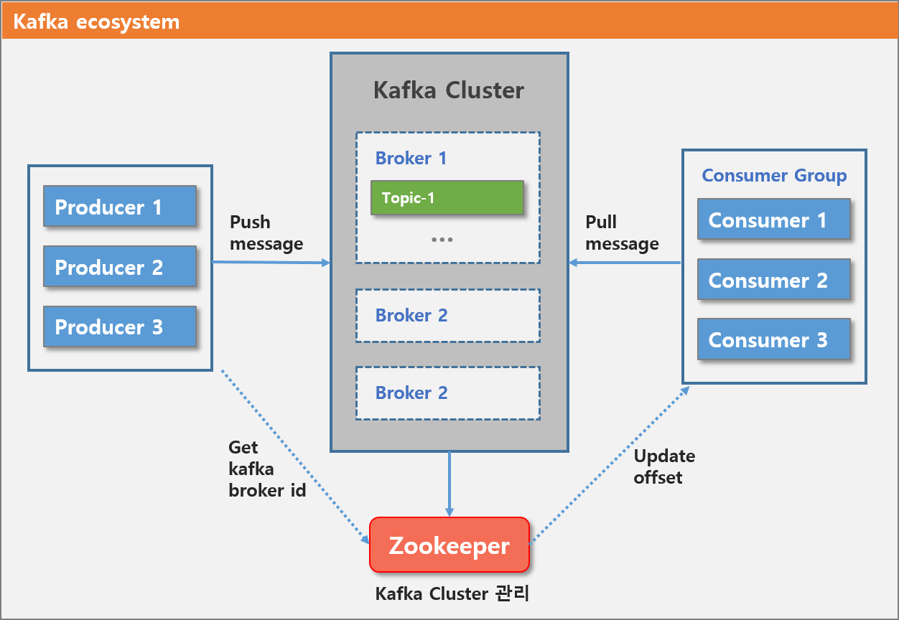

## Apache Kafka
- https://kafka.apache.org/

### Kafka(카프카)란?
- 대용량, 대규모 메시지 데이터를 빠르게 처리하도록 개발된 분산 메시징 플랫폼
- 즉, 어플레이션 간 메시지를 교환하기 위해 사용

### 사용 사례
- 서로 다른 구성 요소 간의 안정적인 데이터 교환
- 애플리케이션 요구사항 변경에 따라 메시징 워크로드 분할
- 데이터 처리를 위한 실시간 스트리밍
- 데이터/메시지 재생에 대한 기본 지원

### 사용 배경
- 실시간 트랜잭션(OLTP) 처리와 비동기 처리가 동시에 이루어지지만 통합된 전송 영역의 부재로 복잡도 증가
- 파이프라인 관리 어려움. 특정 부분 수정 시, 앞단부터 다 수정해야 하는 문제
- 카프카가 발신자와 수신자 연결해줌
  - 발신자(Publish): 카프카에게 데이터를 전송하기만 하면 됨. 누가 받는지는 상관 X
  - 수신자(Subscribe): 원하는 토픽을 구독

### 구조
- Before  
    
  - end-to-end 연결 방식의 아키텍쳐
  - 데이터 연동 복잡성 증가

- After  
    
  - 프로듀서/컨슈머 분리
  - 높은 처리량

### 구성요소
- `Event`: Producer와 Consumer가 데이터를 주고받는 단위
- `Producer`: Kafka에 Event를 게시(post)하는 클라이언트 어플리케이션
- `Consumer`: 이러한 Topic을 구독하고 이로부터 얻어낸 이벤트를 처리하는 클라이언트 어플리케이션
- `Topic`: Event가 쓰이는 곳. Producer는 이 Topic에 Event를 게시. Consumer는 Topic으로부터 Event를 가져와 처리. Topic은 파일시스템의 폴더와 유사하며, Event는 폴더 안의 파일과 유사함. 
    - Partition: Topic은 여러 Broker에 분산되어 저장되며, 이렇게 분산된 Topic을 Partition이라고 한다. 어떤 Event가 Partition에 저장될지는 Event의 key에 의해 정해지며, 같은 key를 가지는 Event는 항상 같은 Partition에 저장된다. 

- **Broker, Zookeeper**: Broker는 카프카 서버를 칭한다. 동일한 노드내에서 여러 개의 broker 서버를 띄울 수 있고, Zookeeper는 이러한 분산 메시지큐의 정보를 관리해주는 역할을 한다. 카프카를 띄우기 위해서는 반드시 주키퍼가 실행되어야 한다. 
- **Replication**: 카프카에서는 replication 수를 임의로 지정하여 topic을 만들 수 있다. replication-factor에 지정한다. 단순 데이터 복제 용도라기보다는, 특정 broker에 문제가 생긴 경우 해당 broker의 역할을 다른 broker에서 즉각적으로 수행할 수 있도록 하기 위한 용도이다.
  
구성 요소를 그림으로 표현하면 다음과 같다.   
  
Producer에서 메시지를 입력하고, Consumer에서 메시지를 읽어갈 때 Zookeeper에서 broker 및 offset 정보를 관리하므로 분산처리가 가능하게 된다. 

---

    
참고

- https://freedeveloper.tistory.com/350?category=909995
- https://ifuwanna.tistory.com/487
- https://team-platform.tistory.com/11?category=829378

