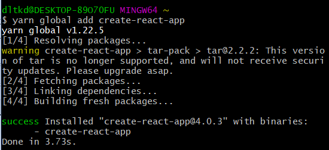
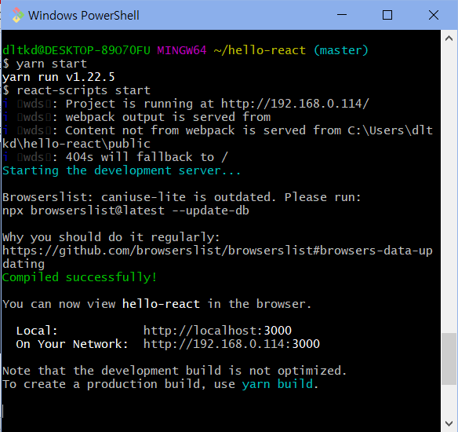
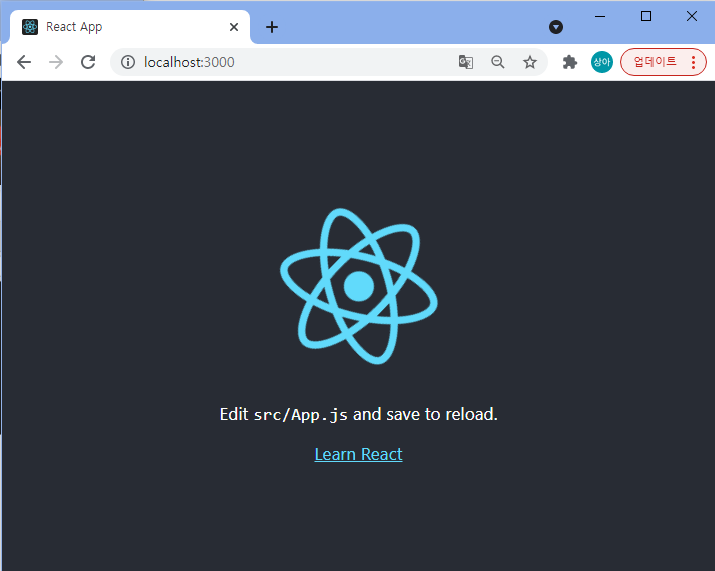
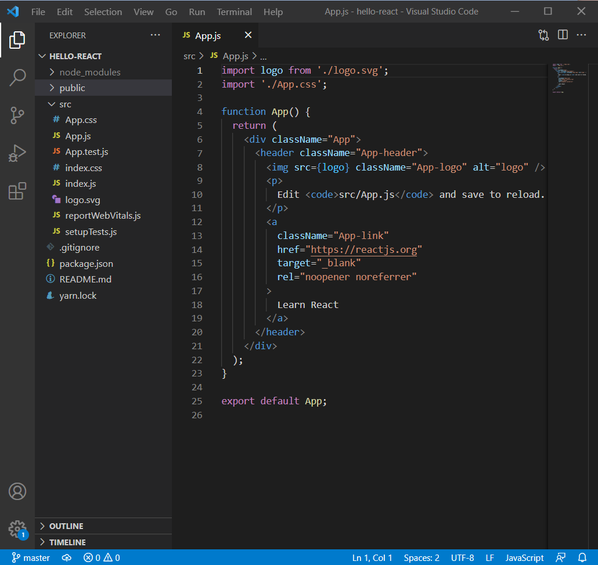
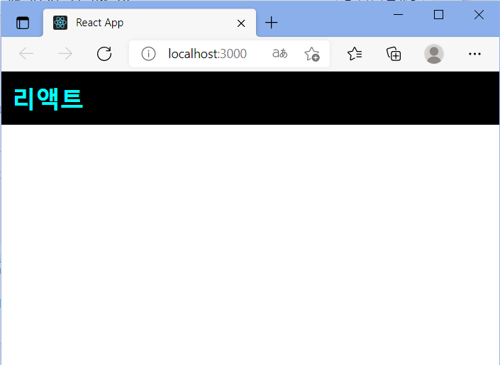

# React 개발 시작하기 - 1

- [참고 사이트](https://velopert.com/3621)를 참고하여 작성한 내용입니다.

> 목차
>
> - 환경설정
> - 컴포넌트 파일 이해
> - JSX


---

## 1. 환경설정

- 설치
  - [yarn](https://classic.yarnpkg.com/en/docs/install#windows-stable) 
  - [node.js](https://nodejs.org/en/)
  - VScode
  - git bash

<br>

- `create-react-app` 설치 및 사용

  - yarn을 통한 설치

    ```bash
    yarn global add create-react-app
    ```

    

    

  - 사용: 터미널에서 다음 명령어 입력

    ```yarn
    create-react-app hello-react
    cd hello-react
    yarn start
    ```

    


결과로 이런 화면이 나오는 것을 볼 수 있다. 



<br>

---

## 2. 컴포넌트 파일 이해

#### - App.js

- 컴포넌트를 만듦




- 컴포넌트를 만드는 방법은 1. `클래스를 통해 만들기`, 2. `함수를 통해 만들기`두 가지 방법
  - 함수를 통한 방법

    ```javascript
    import logo from './logo.svg';
    import './App.css';
    
    function App() {
      return (
        <div className="App">
          <header className="App-header">
            
            <p>
              Edit <code>src/App.js</code> and save to reload.
            </p>
            <a
              className="App-link"
              href="https://reactjs.org"
              target="_blank"
              rel="noopener noreferrer"
            >
              Learn React
            </a>
          </header>
        </div>
      );
    }
    
    export default App;
    ```

  - 클래스를 통한 방법

    ```javascript
    import React, { Component } from 'react';
    import logo from './logo.svg';
    import './App.css';
    
    class App extends Component {
      render() {
        return (
          <div className="App">
            <header className="App-header">
              
              <h1 className="App-title">Welcome to React</h1>
            </header>
            <p className="App-intro">
              To get started, edit <code>src/App.js</code> and save to reload.
            </p>
          </div>
        );
      }
    }
    
    export default App;
    ```

    

- 컴포넌트에서 내부에서 JSX를 return 해 주어야 한다.

- 위의 HTML같은 코드가 JSX이다.

- `export default App;`: 우리가 작성한 컴포넌트를 다른 곳에서 불러와서 사용할 수 있도록 내보내준다. 

<br>

#### - index.js

```javascript
import React from 'react';
import ReactDOM from 'react-dom';
import './index.css';
import App from './App';
import reportWebVitals from './reportWebVitals';

ReactDOM.render(
  <React.StrictMode>
    <App />
  </React.StrictMode>,
  document.getElementById('root')
);

reportWebVitals();
```

- 브라우저 상에서 우리의 리액트 컴포넌트를 보여주기 위해 `ReactDOM.render` 함수 사용
  - 첫 번째 파라미터: 렌더링 할 결과물
  - 두 번째 파라미터: 컴포넌트를 어떤 DOM에 그릴지 정해줌

- id가 root인 DOM을 찾아 그리도록 설정되어 있음. 해당 DOM은 public/index.html 파일에서 찾아볼 수 있다. 

  - 해당 파일 안의 이 코드를 찾아 렌더링해주게 된다. 

    ```html
    <div id="root"></div>
    ```

  

---

## 3. JSX

- 얼핏 보기에는 HTML같으나, Javascript이다.

- xml 형태의 코드를 자바스크립트로 변환해야 하기 때문에, JSX를 제대로 사용하기 위해 우리는 몇 가지 규칙을 준수해 줘야 한다. 

<br>

### 1) 꼭 닫혀야 하는 태그

- `<div>` 태그는 종료시 꼭 `</div>`태그로 닫아줘야 한다. 
- html에서 `input`이나 `br`태그 작성시에는 태그를 닫지 않아도 되지만, 리액트에서는 오류가 발생한다. 

<br>

### 2) 감싸져 있는 엘리먼트

- 두 개 이상의 엘리먼트는 무조건 하나의 엘리먼트로 감싸져 있어야 한다.

  ```javascript
  // src/App.js
  import React, { Component } from 'react';
  
  class App extends Component {
    render() {
      return (
        <div>
          Hello
        </div>
        <div>
          Bye
        </div>
      );
    }
  }
  export default App;
  ```

  - 오류가 발생한다.

- 문제를 해결하려면 다음과 같이 코드를 작성해야 한다. 

  ```javascript
  import React, { Component } from 'react';
  
  class App extends Component {
    render() {
      return (
        <div>
          <div>
            Hello
          </div>
          <div>
            Bye
          </div>
        </div>
      );
    }
  }
  export default App;
  ```

  

- 가장 간단하게 해결하는 방법은 `div`로 감싸주는 것이지만, 단순히 감싸기 위해 `div`를 사용하는 경우 코드가 꼬이게 될 수 있다. 
- 이런 경우에는 `Fragment`를 사용하면 된다. 

<br>

### 3) JSX 안에 자바스크립트 값 사용하기

- JSX 내부에서 자바스크립트 값을 사용할 때는 다음과 같이 사용한다. 

  ```javascript
  import React, { Component } from 'react';
  
  class App extends Component {
    render() {
      const name = 'react';
      return (
        <div>
          hello {name}!
        </div>
      );
    }
  }
  export default App;
  ```

  - `const`: 한 번 선언하고 바뀌지 않는 값을 설정할 때 사용된다.
  - `let`: 바뀌게 될 수 있는 값
  - 기존 자바스크립트의 `var`와 유사하지만, 작동 방식에 있어 scope가 다르다.
    - `var`: scope가 함수 단위
    - `const`, `let`: scope가 블록 단위

<br>

### 4) 조건부 렌더링

JSX 내부에서 조건부 렌더링을 할 때는 보통 `삼항 연산자`를 사용하거나, `AND 연산자`를 사용한다. 

반면, **`IF문`은 사용할 수 없다!** 사용하려면 IIFE을 사용해야 한다. 

- 삼항 연산자

  ```javascript
  1 + 1 === 2
    ? (<div>맞아요!</div>)
    : (<div>틀려요!</div>)
  ```

- AND 연산자

  ```javascript
  1 + 1 === 2 && (<div>맞아요!</div>)
  ```

<br>

### 5) style과 className

스타일은 다음과 같이 작성할 수 있다. 

```javascript
import React, { Component } from 'react';

class App extends Component {
  render() {
    const style = {
      backgroundColor: 'black',
      padding: '16px',
      color: 'white',
      fontSize: '12px'
    };

    return (
      <div style={style}>
        hi there
      </div>
    );
  }
}

export default App;
```

<br>

직접 작성해 보자 !

#### - App.css

```css
.App {
  background: black;
  color: aqua;
  font-size: 36px;
  padding: 1rem;
  font-weight: 600;
}
```

#### - App.js

```javascript
import React, { Component } from 'react';
import './App.css'

class App extends Component {
  render() {
    return (
      <div className="App">
        리액트
      </div>
    );
  }
}
export default App;
```


구동 후 [React App](http://localhost:3000/)에 접속해 보면 다음과 같은 화면이 출력된 것을 볼 수 있다.



